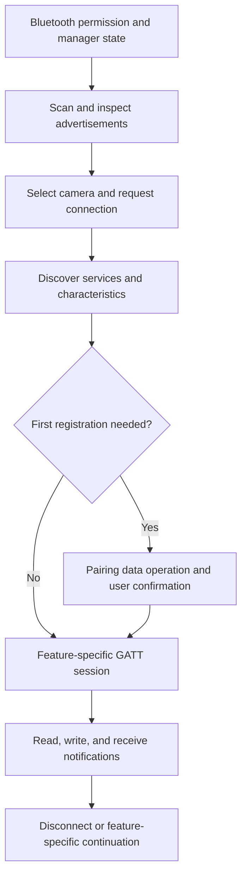

# Creators' App iOS Bluetooth research

## Summary

The supplied Creators' App uses native CoreBluetooth through `IEMBLEModule_ios.framework`. Its readable symbols expose scanning, advertisement parsing, connection, GATT discovery, pairing writes, reads/writes, notifications, and local paired-device bookkeeping.

The most useful additional protocol evidence is a seven-byte constant associated with `PAIRING_DATA` initialization: `06 08 01 00 00 00 00`. It matches this project's existing pairing payload. The binary does **not** independently establish that this value is written to EE01: the relevant implementation and UUID strings are encrypted.

This is static analysis only. No app execution, camera connection, Bluetooth capture, or GATT write was performed. No encryption was removed.

## Artifact and evidence boundaries

Paths below are relative to `data/Payload/Creators App.app/` unless stated otherwise.

| Artifact | Evidence |
| --- | --- |
| `Info.plist` | Creators' App version `3.5.0`, bundle version `1.3.2`, identifier `jp.co.sony.playmemoriesmobile.portalapp` |
| `Creators App` | Imports the BLE wrapper API and `PAIRING_DATA`; its own symbols are substantially stripped |
| `Frameworks/IEMBLEModule_ios.framework/IEMBLEModule_ios` | ARM64 Swift framework with readable exported and local symbol names |
| `en.lproj/Localizable.strings` | Binary plist containing pairing, location-linkage, connection, and recovery instructions |
| `camera_guide.json` | Lists `ILCE-7CM2` / α7C II; this is product coverage, not a BLE protocol test |

SHA-256:

- `data/sony-creators-app.ipa`: `08fa6d79f47bc164eb0f4cb4a1b37594688757695fda681bd175b03fe17e77e2`.
- BLE framework executable: `b8af052c8967c2e5b8d2462cbbac851d7bf76a4de7541fa8cdbb025596a84206`.

The main executable, BLE framework executable, `Info.plist`, and English localization were compared byte-for-byte against their entries in the IPA and matched.

`LC_ENCRYPTION_INFO_64` reports `cryptid = 1`:

| Executable | Encrypted file range, end exclusive |
| --- | --- |
| `Creators App` | `[16384, 35618816)` |
| `Frameworks/IEMBLEModule_ios.framework/IEMBLEModule_ios` | `[16384, 163840)` / `[0x4000, 0x28000)` |
| `Frameworks/ImagingEdgeAPI.framework/ImagingEdgeAPI` | `[16384, 819200)` |

The BLE framework's `__text`, UUID strings, Objective-C method names, and Swift reflection strings fall in the protected range. `__DATA` and `__LINKEDIT` remain useful. `otool -ov` explicitly reports strings from protected sections. Symbol names establish API shape, not branch conditions, call ordering, or successful runtime behavior. Random printable fragments from ciphertext are not protocol evidence.

## Native Bluetooth architecture

`otool -L` confirms the BLE framework links `CoreBluetooth.framework`. `nm` followed by `xcrun swift-demangle` reveals these APIs, which the main app also imports:

| API, arguments abbreviated | What it establishes |
| --- | --- |
| `BleWrapper.getAuth(handler:)` | A separate authorization query exists; local `BleUtil.getAuth(CBCentralManager)` takes a central manager, not camera credentials |
| `getCentralStatus()`, `startObserveCentralState(handler:)` | Bluetooth manager state can be queried and observed |
| `scan(with: BleUUID?, for: Int, options:, isCheckFtpSetting:, handler:)` | Scan API accepts an optional UUID, integer parameter, options, and an FTP-check flag; callbacks include discovered devices and completion |
| `stopScan()` | Explicit scan cancellation |
| `connect(with: String, options:, handler:)` | Connection is requested using a string identifier; interpreting it as the device UUID is supported by `BleDevice.deviceUUID` and Foundation UUID imports |
| `pairing(value: Data, to: BleUUID, characteristicUUID: BleUUID, withResponse: Bool, handler:)` | Pairing is exposed as a service/characteristic data operation, separate from connection |
| `read(with:, characteristicUUID:, handler:)` | Explicit characteristic reads |
| `write(value:, to:, characteristicUUID:, withResponse:, handler:)` | Writes support a response-policy argument; actual call-site values are unknown |
| `setNotify(_: Bool, with:, characteristicUUID:, handler:)` | Explicit subscription control and notification callbacks |
| `disconnect()` | Explicit link teardown |

`BleWrapper` implements the central callbacks `didDiscover`, `didConnect`, `didFailToConnect`, `didDisconnectPeripheral`, and `centralManagerDidUpdateState`. Its peripheral callbacks include `didDiscoverServices`, `didDiscoverCharacteristicsFor`, `didUpdateValueFor`, `didWriteValueFor`, `didUpdateNotificationStateFor`, and `didModifyServices`.

The following is an architectural reconstruction from those interfaces and the UI instructions, **not a recovered call trace**:



### Advertisement and device state

The framework imports `CBAdvertisementDataManufacturerDataKey`, `CBAdvertisementDataLocalNameKey`, and `CBAdvertisementDataIsConnectable`.

Readable local symbols include:

- `BleUtil.isSonyDevice(advertisementData:)` at VM address `0x68c0`.
- `BleUtil.getAdvertiseVersion(advertisementData:)` at `0x6ba8`.
- `BleUtil.getModelCode(advertisementData:)` at `0x6d48`.
- `BleDevice.updateFlags(funcList: [(type: AdvDiType, data: Data)])` at `0x1783c`.
- `BleScanUtil.currentFtpCheckMode`.

`BleDevice` exposes `deviceUUID`, `deviceName`, `advertisementData`, `advertiseDataVersion`, `modelCode`, `isConnectable`, and `isPaired`. Capability/state properties include:

- `isPairingSupport`, `isPairingEnabled`.
- `isDILSupport`, `isDILEnabled`.
- `isDIRCSupport`, `isDIRCEnabled`.
- `isSettingSupport`, `isSettingEnabled`.
- `isBleKeepAliveSupport`, `isCameraPowerOn`, `isRemotePowerOn`.
- `isWifiHandoverSupport`, `isWifiHandoverEnabled`, `wifiMode`.
- Smartphone remote/transfer, push-transfer, and background-transfer support/status.

This supports capability-aware discovery rather than selection solely by camera name. The symbols do not reveal manufacturer field offsets, bit masks, enum raw values, the meaning of every abbreviation, or the FTP-filter predicate.

### Pairing state is not the same as an OS bond

The framework contains `BleUtil.isPaired(uuid:)`, `addPaired(uuid:)`, `removePaired(uuid:)`, `addPairedDevice(device:)`, `getPairedDevices()`, and `removePairedDevice(device:)`. `BleDevice` supports encoding/decoding, and the framework imports `NSUserDefaults`, `NSKeyedArchiver`, and `NSKeyedUnarchiver`.

These are evidence of app-side paired-device bookkeeping. They do not establish a public API for enumerating or deleting iOS Bluetooth bonds. UI strings explicitly direct users to delete pairing information in both smartphone Bluetooth settings and the camera menu.

Do not interpret a saved `isPaired` flag, a successful BLE connection, or an app-side removal operation as proof of the current OS bond state.

## Pairing payload recovered from unencrypted data

The BLE framework symbol table identifies:

| VM address | Demangled symbol |
| --- | --- |
| `0x1a38c` | `PAIRING_DATA.unsafeMutableAddressor : Foundation.Data` |
| `0x1a3cc` | `one-time initialization function for PAIRING_DATA` |
| `0x2c218` | `outlined variable #0 of one-time initialization function for PAIRING_DATA` |
| `0x2da30` | `PAIRING_DATA : Foundation.Data` |

`__DATA` has VM address and file offset `0x28000`, so the following addresses are also file offsets for this artifact:

```text
0x2c230: 07 00 00 00 00 00 00 00
0x2c238: 0e 00 00 00 00 00 00 00
0x2c240: 06 08 01 00 00 00 00 00
```

The first two words are consistent with Swift array storage containing seven elements and its capacity/flags representation. The seven-byte sequence at `[0x2c240, 0x2c247)` belongs to the outlined storage associated by symbol name with the pairing initializer. The eighth displayed byte is not evidence of an eight-byte packet.

**Conclusion:** there is strong static evidence for the seven-byte pairing input `06 08 01 00 00 00 00`. It matches `CameraGPSLink/SonyProtocol.swift:26` and the accepted A7C II EE01 value recorded in [the existing BLE map](a7c2-ble-map.md).

**Limit:** the initializer and pairing implementation are encrypted. This analysis does not recover the complete transformation/call path, destination UUID, actual `withResponse` argument, retry behavior, or whether a disconnect follows pairing. The EE01 mapping comes from the existing project evidence, not from readable UUID strings in this IPA.

## User-visible connection workflow

These are exact localization-key anchors in `en.lproj/Localizable.strings`; resources can include legacy, shared Android, or unused text, so they are not proof of a particular iOS branch executing.

| Key | Relevant instruction |
| --- | --- |
| `STRID_guide_bluetooth_description_main_1` | Pair the camera and smartphone, then register the camera in the camera list |
| `STRID_guide_bluetooth_step2_1` | Select the camera when “Pairing” is displayed beside its name |
| `STRID_operate_camera_and_open_pairing_screen` | Display the camera's Bluetooth pairing screen |
| `STRID_camera_pairing_operation_description` | Press OK on the camera |
| `STRID_location_info_transfer_pair_camera_to_start` | First-use location linkage requires pairing through the camera Bluetooth menu |
| `STRID_location_info_of_cameras_on` | Enable the camera's Location Info. Link setting |
| `STRID_camera_wifi_setting_need_bt_connection` | Camera Wi-Fi configuration requires a Bluetooth connection |
| `STRID_getting_wifi_connect_info` | Obtain information from the camera before switching to Wi-Fi |
| `STRID_dialog_connection_ble_error` | Check Bluetooth enabled or FTP Transfer / PC Remote disabled |
| `STRID_location_info_transfer_pair_again_1` | Remove app camera information when pairing information is inconsistent |
| `STRID_dialog_body_confirm_delete_paired_camera_1` | Remove the device under smartphone Bluetooth settings |
| `STRID_dialog_body_confirm_delete_paired_camera_2` | Remove the smartphone under camera Network → Bluetooth → Manage Paired Device |
| `strid_device_setup_setting_desc` | Disable another smartphone's location linkage before using this smartphone |

Bluetooth therefore serves discovery/control and location linkage, while some operations hand over to Wi-Fi. This does not establish that every feature uses Wi-Fi or every connection performs handover.

## Background behavior and timeout limits

`Info.plist` declares `bluetooth-central`, `location`, `fetch`, and `external-accessory` background modes. It also provides Bluetooth and location permission descriptions for Location Information Linkage.

The BLE framework has `startTimer(after: Int, handler:)`, `stopTimer()`, and an `OS_dispatch_source_timer`. It also retains closure symbols for scan, connect, read, pairing, write, and notification operations, but their relationship to the timer cannot be established from names alone. Timer support is present; per-operation timeout coverage, values, units, deadlines, retry counts, and cancellation semantics remain unknown.

Neither these symbols nor background-mode declarations prove indefinite background execution or a specific state-restoration/reconnect algorithm. No concrete restoration configuration was established here. A keep-alive capability property alone does not identify a keep-alive packet or cadence.

## Relationship to this project's location protocol

The following sequence is **existing project/A7C II evidence**, not a sequence recovered from this IPA:

1. Complete OS pairing and, when explicitly requested in camera pairing mode, initialize `EE01` with `06 08 01 00 00 00 00`.
2. Start a separate location session; ordinary reconnect/location sessions do not send EE01.
3. Subscribe to `DD01` when supported, then write `DD30=01` and `DD31=01` for the modern profile.
4. Read `DD32`, `DD33`, and `DD21`; select the supported DD11 packet format.
5. Send DD11 location packets.
6. Clean up with `DD31=00`, then `DD30=00`, and stop notifications.

See [A7C II BLE map](a7c2-ble-map.md), [location profile specification](sony-location-profile-spec.md), `CameraGPSLink/SonyProtocol.swift`, and `CameraGPSLink/SonyLocationSessionPlan.swift`.

Implications:

- Retain the distinction between transport connection, OS bond, Sony pairing initialization, and location-session readiness.
- The pairing constant now has additional first-party binary evidence; no payload change is indicated.
- Advertisement capabilities are worth preserving separately from app registration state. The IPA does not justify inventing new bit masks.
- Keep existing bounded foreground attempts. Sony timer symbols are not sufficient evidence to copy a timeout or background retry policy.
- Do not infer DD30/DD31 ordering, DD11 encoding, GATT UUID aliases, or a modern-protocol threshold from the encrypted executable.

Further verification would require an authorized readable runtime image or a controlled Bluetooth trace, ideally comparing first pairing, ordinary reconnect, location start/stop, and camera power cycling. Redact device identifiers, Wi-Fi credentials, and location data before retaining captures.

## Reproduce the key findings

Run from the repository root on macOS with Xcode command-line tools. Commands only inspect local files.

```bash
app='data/Payload/Creators App.app'
ble="$app/Frameworks/IEMBLEModule_ios.framework/IEMBLEModule_ios"

plutil -extract CFBundleShortVersionString raw -o - "$app/Info.plist"
plutil -extract UIBackgroundModes json -o - "$app/Info.plist"
otool -l "$ble" | grep -A5 LC_ENCRYPTION_INFO_64
otool -L "$ble"
nm "$ble" | xcrun swift-demangle | grep -E 'BleWrapper|BleUtil|PAIRING_DATA'
nm "$app/Creators App" | xcrun swift-demangle | grep IEMBLEModule_ios
plutil -p "$app/en.lproj/Localizable.strings" | grep -iE 'pairing|location_info|bluetooth'
```

Verify the payload against the fingerprinted artifact, without treating encrypted code as disassembly:

```bash
uv run python - <<'PY'
from pathlib import Path
import hashlib
import struct

path = Path('data/Payload/Creators App.app/Frameworks/IEMBLEModule_ios.framework/IEMBLEModule_ios')
data = path.read_bytes()
assert hashlib.sha256(data).hexdigest() == 'b8af052c8967c2e5b8d2462cbbac851d7bf76a4de7541fa8cdbb025596a84206'
assert struct.unpack_from('<Q', data, 0x2c230)[0] == 7
payload = data[0x2c240:0x2c247]
assert payload == bytes.fromhex('06 08 01 00 00 00 00')
print(payload.hex(' '))
PY
```
