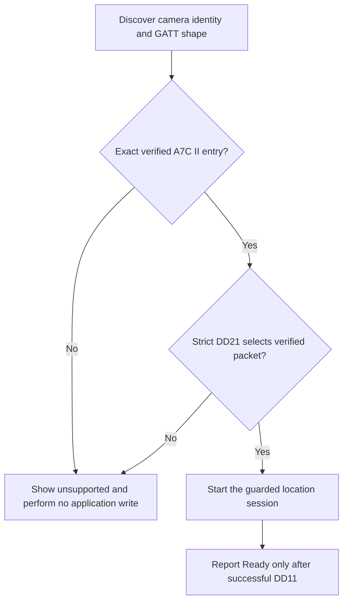

# A7C II-only iOS App Store release plan

- Status: Accepted; implementation in progress.
- Decision date: 2026-08-31.
- Scope: The public iOS App Store release only.
- Supported camera target: Sony Alpha 7C II (`ILCE-7CM2`).
- Initial qualification identity: firmware `2.01`, advertisement protocol `101`, modern profile, strict 95-byte `DD11` packet.

## Decision

The first public Camera GPS Link release will support only the Sony Alpha 7C II (`ILCE-7CM2`).
The release will not advertise, experimentally enable, or write location data to any other camera model.
The initial verified support claim will be limited to firmware `2.01` until another firmware receives the same physical iOS qualification.
The App Store product name will remain **Camera GPS Link** so the app does not appear to be an official Sony product.
The App Store subtitle and description may use the camera name only to describe compatibility accurately.
The product page and in-app About information will state that the app is independent and is not affiliated with or endorsed by Sony.

Update 2026-09-12: the user explicitly directed public Release to expose optional Background before physical background qualification. This changes availability, not evidence: Background remains documented as unverified and subject to Always Location permission and iOS scheduling.

This decision does not remove capability-driven Swift protocol code or automated iOS fixtures from this repository.
The Python CLI and its read-only research tools are maintained separately in the [SonyGeoTag repository](https://github.com/narumiruna/sony-geotag) and do not define the public iOS support claim.

## Rationale

Only A7C II hardware is available for repeatable physical testing.
A narrow support claim keeps App Store metadata consistent with evidence that can be reproduced before every release.
Failing closed for unknown models and firmware avoids asking public users to approve an experimental write to unsupported camera hardware.
A single-camera first release also reduces support load, reviewer ambiguity, and the risk that the app appears to be a public beta.

## Public compatibility policy

A public Release build may start a location-writing session only when all of the following facts match a verified compatibility entry:

- The normalized model is exactly `ILCE-7CM2`.
- The readable firmware is exactly a physically qualified firmware, initially `2.01`.
- The advertisement protocol version is exactly a physically qualified version, initially `101`.
- Complete service discovery resolves to the expected modern profile.
- Required characteristic ownership and write-with-response properties match the verified descriptors.
- Strict `DD21` parsing selects the verified 95-byte `DD11` packet.

An unreadable identity, different firmware, different model, inconsistent descriptor set, malformed `DD21`, or different packet size must stop before notification subscription or application-level GATT writes.
A public Release build must show a clear unsupported message and must not offer an experimental override.
Debug builds and automated tests may retain experimental fixtures, provided that no debug-only path is reachable in Release builds.
Pairing initialization must apply the same exact-identity policy before writing `EE01`.

## Product wording

Recommended App Store name:

> Camera GPS Link

Recommended subtitle:

> GPS Link for Alpha 7C II

Required compatibility statement:

> Designed exclusively for Sony Alpha 7C II (`ILCE-7CM2`).

Initial firmware statement:

> Tested with Sony Alpha 7C II firmware 2.01.

Required independence statement:

> Camera GPS Link is an independent app and is not affiliated with or endorsed by Sony.

The description must not imply support for A7 III, A7 IV, A6700, A7R V, A7S III, A1, ZV-E1, ZV-E10 II, or an unspecified family of Sony cameras.
The description must explain that background updates are opportunistic and cannot guarantee a fresh location immediately before every photo.

## Implementation plan

### 1. Align release policy and user interface

- Add an explicit A7C II-only public release policy separate from generic protocol capability resolution.
- Add the exact qualified A7C II identity to the verified iOS compatibility registry only after physical iOS evidence passes.
- Make every non-A7C II identity unsupported in Release builds without an approval action.
- Make an unqualified A7C II firmware unsupported in Release builds until that exact firmware passes qualification.
- Remove multi-model support claims and experimental-camera instructions from public iOS copy.
- Keep generic protocol fixtures in tests so fail-closed behavior remains covered.

### 2. Complete physical qualification

- Run the Release-equivalent app on a physical iPhone and A7C II firmware `2.01`.
- Confirm model, firmware, protocol `101`, modern profile, strict `DD21`, and 95-byte packet resolution.
- Start foreground geotagging and wait for **Ready to Geotag** after the first successful `DD11` write.
- Capture a new JPEG or HEIF image while the session is active.
- Verify the photo timestamp and GPS EXIF with the external [`sonygeotag verify-exif`](https://github.com/narumiruna/sony-geotag) tool without committing the photo.
- Stop geotagging and verify DD31/DD30 cleanup leaves the camera usable.
- Record sanitized evidence in `docs/compatibility/ilce-7cm2-2.01.md`.
- Promote the exact iOS identity to verified only after all preceding checks pass.

### 3. Decide the first-release background scope

- Physically test Always Location permission, background transition, reconnect, location refresh, camera write, cleanup, and representative battery behavior before advertising background support.
- If background qualification does not pass, hide or disable **Continue in Background** in the first public release.
- Never infer background support from a successful foreground test.

### 4. Complete privacy and support surfaces

- Add an easily accessible in-app About section with Privacy Policy and Support links.
- Explain how to stop geotagging and revoke Location permission in iOS Settings.
- Keep App Store privacy answers aligned with the no-server, no-analytics, and no-tracking implementation.
- Include the exact supported model, firmware scope, background limitation, and independence statement in support documentation.

### 5. Prepare App Review

- Produce App Store screenshots showing the disconnected, connecting, ready, settings, and diagnostics states without exposing coordinates.
- Provide App Review notes with exact A7C II camera setup, pairing, permission, connection, and verification steps.
- Provide a physical-device demonstration video because App Review may not have the required camera.
- Explain why Location, Always Location, Bluetooth, and background modes are directly required by geotagging.
- Create a signed Release archive, run Xcode validation, and distribute the same build through TestFlight before submission.
- Keep the app description, Privacy Policy URL, Support URL, App Privacy answers, export-compliance answer, and review notes complete and consistent.

## Verification gates

The release is ready for App Store submission only when every item below is verified:

- [ ] `just check` passes from a clean working tree.
- [ ] A signed Release archive passes Xcode validation.
- [ ] The TestFlight build completes the foreground A7C II workflow on a physical iPhone.
- [ ] A newly captured JPEG or HEIF file passes GPS EXIF verification.
- [ ] The exact A7C II firmware `2.01` identity is verified in the iOS compatibility registry.
- [ ] Every other model and unqualified firmware fails closed without a Release override.
- [ ] Background behavior passes physical qualification; until then, public documentation must disclose that the user-directed option is unverified and opportunistic.
- [ ] Privacy Policy and Support links are available inside the app and in App Store Connect.
- [ ] Store metadata states A7C II-only compatibility and includes the independence statement.
- [ ] App Review receives reproducible setup instructions and a hardware demonstration video.

## Future changes

Adding another camera model or firmware requires a separate explicit scope decision.
Each new public compatibility entry requires physical iOS write, fresh-photo EXIF, cleanup, and background evidence for every feature advertised.
Automated descriptor matching alone must never expand the public support claim.
