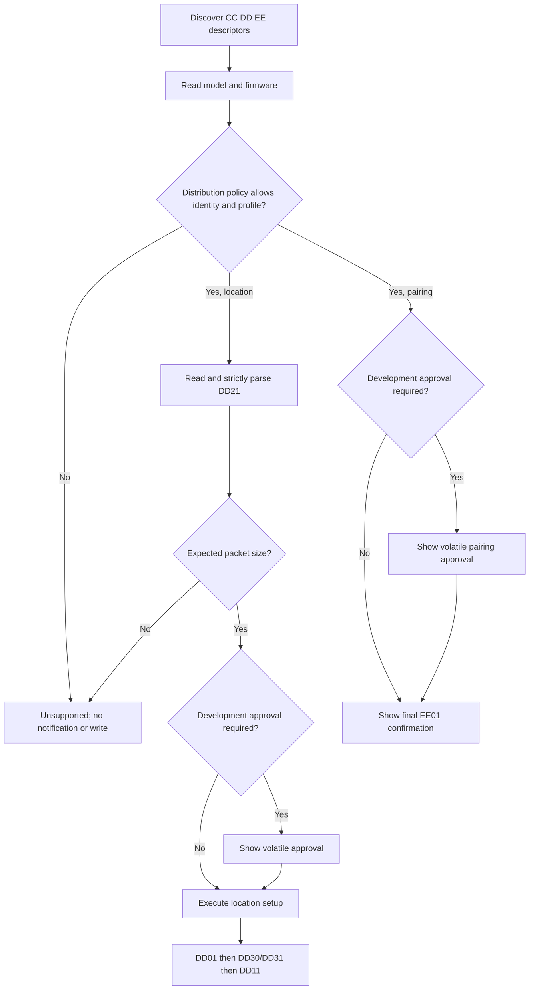

# A7C II-only iOS Release gate implementation plan

- Status: Implemented; physical qualification pending.
- Date: 2026-08-31.
- Parent decision: [`A7C II-only iOS App Store release plan`](2026-08-31_ios-a7c2-only-app-store-release-plan.md).
- Scope: Enforce the public Release compatibility boundary before any Sony notification subscription or application-level GATT write.

## Goal

Keep generic capability-driven Sony protocol code available for development while making public Release builds fail closed unless an exact physically verified compatibility entry matches.
Provide a narrowly scoped qualification mode for A7C II firmware `2.01` without treating the candidate as publicly verified.
Until background behavior passes physical qualification, public Release builds must force foreground-only operation.

## Build modes

| Mode | Compatibility behavior | Experimental approval | Background option |
| --- | --- | --- | --- |
| Development (`DEBUG`) | Generic executable profiles remain available for fixtures and explicit session approval. | Allowed | Available |
| Qualification (`QUALIFICATION`) | Only the exact A7C II `2.01` candidate identity, descriptor fingerprint, modern profile, protocol `101`, and 95-byte packet may proceed. | Not allowed | Available for physical qualification |
| Public Release | Only exact entries in the verified public registry may proceed. The registry remains empty until physical iOS qualification passes. | Not allowed | Hidden and forced off until qualification passes |

## Implementation

### 1. Add a distribution policy

- Add `SonyDistributionMode`, `SonyReleaseCompatibilityEntry`, and `SonyReleasePolicy` in a dedicated source file.
- Select the current mode through one compile-time boundary: `QUALIFICATION`, then `DEBUG`, otherwise public Release.
- Record the sanitized A7C II `2.01` candidate descriptor fingerprint separately from the empty verified registry.
- Match normalized model, readable firmware, advertisement protocol, resolved profile, and the recognized CC/DD descriptor fingerprint exactly.
- Return an explicit preflight authorization that states whether session approval is required and which packet size is expected.

### 2. Move DD21 into read-only preflight

- Complete service/characteristic discovery and CC0A/CC0B identity reads first.
- Evaluate the distribution policy before reading DD21.
- For a permitted location candidate, read and strictly parse DD21 before DD01 subscription, DD30/DD31, or DD11.
- Reject malformed DD21 and packet-size mismatches as unsupported.
- Remove DD21 from the write-capable location setup plan; the plan starts only after preflight succeeds.
- Apply the exact identity/profile/descriptor policy to EE01 pairing before presenting its final write confirmation.

### 3. Enforce UI and background restrictions

- Never enter the experimental approval state when the active policy forbids it.
- Make the unsupported state the only public recovery path for unverified identities.
- Filter **Continue in Background** from public Release settings.
- Sanitize persisted and newly applied settings so stale `backgroundLinkEnabled=true` cannot reactivate background services.
- Enforce the same restriction in `CameraBLEManager` as defense in depth.

### 4. Add qualification and Release build checks

- Add `just ios-build-release-nosign`.
- Add `just ios-build-qualification-nosign`, using Release optimization with `QUALIFICATION` as the active Swift condition.
- Include both builds in `just ios-check`.
- Keep public archives on the ordinary Release configuration without `QUALIFICATION`.

### 5. Verify behavior

Add or update tests proving:

- Exact A7C II candidate matching succeeds only in qualification mode.
- Model, firmware, protocol, profile, descriptor, and packet-size mismatches fail closed.
- Public Release rejects the candidate while the verified registry is empty.
- Development retains explicit experimental approval.
- Qualification and public Release never expose experimental override.
- DD21 preflight occurs before notification and writes.
- Rejected location and pairing requests enqueue no DD01, DD30, DD31, DD11, or EE01 operation.
- Public Release hides and force-disables background operation, including stale persisted settings.
- Debug, Qualification, and Release configurations compile.
- `just check` passes.

## Automated verification

The recipes composing `just check` pass after implementation:

- source-line checker self-test and Swift source line limit;
- smoke test, Swift typecheck, plist/project lint;
- Debug Simulator and unsigned Debug device builds;
- unsigned public Release and Release-optimized `QUALIFICATION` device builds;
- 71 XCTest unit tests;
- 19 XCUITests, including public Release override/background assertions.

## Qualification handoff

After this gate lands:

1. Build the Release-equivalent qualification variant.
2. Run the physical iPhone and A7C II `2.01` foreground workflow.
3. Verify a fresh JPEG or HEIF with `sonygeotag verify-exif`.
4. Verify DD31/DD30 cleanup and update `docs/compatibility/ilce-7cm2-2.01.md`.
5. Move the exact candidate into the verified public registry only after all evidence passes.
6. Rebuild the ordinary public Release variant and verify that only the promoted entry proceeds.
