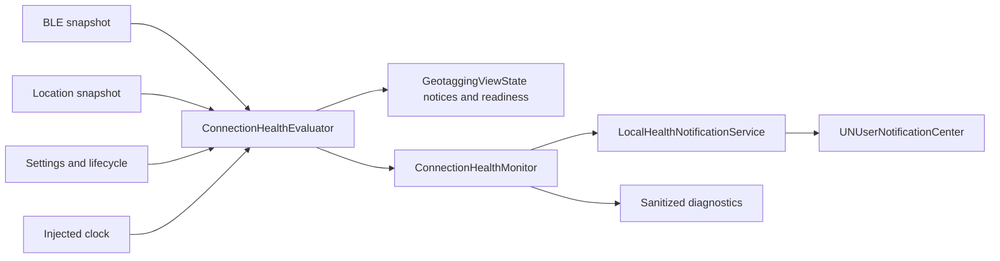

# Connection health alerts plan

## Goal

Add opt-in, local-only shooting alerts and clearer location freshness feedback without changing Sony protocol behavior or claiming that iOS can guarantee background execution.

Success means an enabled user is warned when a previously ready geotagging session loses coverage, when the camera's last confirmed location reaches five minutes old, or when a foreground-only session stops after the app enters the background. The app must cancel obsolete warnings after a new successful `DD11`, avoid alerts for intentional stops and initial connection failures, and clearly distinguish a stale or low-accuracy iPhone fix from a stale camera update.

## Context

- `GeotaggingViewState` already changes a linked session from **Ready to Geotag** to **Location Update Delayed** when `lastSentAt` is more than five minutes old.
- `CameraBLEManager` rejects iPhone fixes older than 120 seconds or more than 10 seconds in the future, but the home screen currently reduces an unusable fix to a generic non-ready location row.
- `CameraGPSLinkAppModel` refreshes time-derived state every 30 seconds and already centralizes service, settings, and lifecycle transitions, making it the appropriate integration boundary for health evaluation.
- Public Release remains foreground-only until separate physical background qualification passes. Alerts must therefore cover the expected loss of coverage when an active foreground-only session enters the background, not imply that notifications keep BLE or Location running.
- The project has no `UserNotifications` integration. Local notifications require user authorization but no push entitlement or remote service.
- `CameraGPSLinkUnitTests/CameraGPSLinkUnitTests.swift` is currently 998 lines. New health tests must go in a separate test file rather than pushing that source over the 1,000-line limit.
- Planning baseline on 2026-09-04: `just source-line-check` and `just ios-typecheck` pass on a clean working tree.

## Architecture

- Add a pure health policy/evaluator for deterministic thresholds and copy-independent state classification.
- Add a stateful monitor that detects episodes, debounces transient disconnects, reschedules stale-update warnings after successful packets, and cancels obsolete requests.
- Hide `UNUserNotificationCenter` behind an injected protocol. Production uses a local notification adapter; unit and UI fixtures use fakes so tests never show a system prompt.
- Keep notification authorization separate from the user's persisted alert preference. The preference records intent; authorization status explains whether iOS can deliver it.

## Non-Goals

- Do not enable or broaden background BLE/Location support in public Release.
- Do not add remote notifications, push entitlements, accounts, analytics, servers, or coordinate uploads.
- Do not change `DD11`, Sony session setup, compatibility policy, packet cadence, or location-write acceptance rules except to share the existing freshness constants with the UI health policy.
- Do not block a valid location write solely because horizontal accuracy exceeds the warning threshold.
- Do not send a separate system notification for every poor-accuracy fix, reconnect attempt, initial connection failure, permission problem, or intentional Stop/Cancel action.
- Do not add configurable timing or accuracy thresholds in this iteration.

## Assumptions

- Health Alerts are off by default for existing and new installs and are enabled explicitly in **Link Settings**.
- Authorized, provisional, and ephemeral notification states are deliverable; denied is blocked; not-determined triggers an in-context authorization request only after the user enables Health Alerts.
- The camera-update stale boundary remains 300 seconds, matching current readiness behavior.
- An iPhone fix is fresh from 10 seconds in the future through 120 seconds old, matching current BLE write safety; a fresh nonnegative fix over 100 m horizontal accuracy is shown as low accuracy but remains writable.
- Unexpected link loss is notified only after a 10-second debounce and only after the current shooting session has completed at least one successful `DD11`.
- Notification titles, bodies, identifiers, and diagnostic events never include coordinates, peripheral identifiers, raw camera names, firmware, or BLE payloads.

## Plan

### 1. Define and test the health contract

- [x] Add a pure `ConnectionHealthPolicy`/evaluator with the exact 300-second camera-update limit, 120-second iPhone-fix age limit, 10-second future-skew allowance, 100 m low-accuracy threshold, and 10-second disconnect debounce; verified by `ConnectionHealthPolicyTests` with an injected clock (`just ios-unit-test`, 96 tests passed).
- [x] Model independently testable health facts for camera update freshness, iPhone fix state (`missing`, `invalid`, `future`, `stale`, `lowAccuracy`, `healthy`), active-session coverage, and expected foreground-only suspension; verified by `ConnectionHealthPolicyTests`, `GeotaggingHealthViewStateTests`, and `ConnectionHealthMonitorTests` (`just ios-unit-test`).
- [x] Make `CameraBLEManager` and the UI evaluator consume the same location freshness constants so safety and display boundaries cannot drift; verified by the existing boundary tests in `CameraBLEManagerTests` and `just ios-smoke` (`iOS smoke test passed`).

### 2. Add an injectable local-notification service

- [x] Add a `HealthNotificationServicing` protocol and production `UNUserNotificationCenter` adapter that can refresh/request authorization, add or replace namespaced requests, and remove only Camera GPS Link health requests from both pending and delivered notifications; verified by typed recording fakes and `HealthNotificationRequestTests` (`just ios-unit-test`).
- [x] Define stable identifiers for delayed link loss, stale camera update, and foreground-only suspension; use generic coordinate-free title/body text, no badge, and the user's opted-in alert/sound authorization; verified by complete payload assertions in `HealthNotificationRequestTests`. A standalone recovery identifier was removed after review because delivery of the preceding loss alert cannot be confirmed race-free.
- [ ] Present this app's health notifications with banner/list and sound while the app is active, while leaving unrelated notification categories untouched; delegate routing passes `HealthNotificationRequestTests`, but a live foreground notification presentation check remains unverified because no iPhone is connected and the no-prompt UI fixtures intentionally inject a fake service.
- [x] Treat notification authorization or scheduling failures as nonfatal: preserve geotagging, clear failed managed-request state, expose a sanitized diagnostic event, and do not replace the primary connection error; verified by `HealthAlertAppModelTests` and `ConnectionHealthMonitorTests` (`just ios-unit-test`).

### 3. Persist the opt-in setting and expose permission state

- [x] Extend `LinkSettings` and `UserDefaultsLinkSettingsStore` with a `healthAlertsEnabled` value that defaults to `false`, preserves existing background/low-power keys and unknown defaults, and loads old installations without migration failure; verified by `HealthAlertSettingsTests` and existing settings tests (`just ios-unit-test`).
- [x] Add a **Health Alerts** section to `LinkSettingsView` with an opt-in toggle, concrete effect preview, and current authorization state (`Not Requested`, `Allowed`, or `Blocked in iOS Settings`); verified by setting Apply/Cancel and blocked-permission XCUITests (`just ios-ui-test`, 25 tests passed before test-file split).
- [x] Request notification authorization only after an applied transition from alerts off to on, never at launch or merely when opening settings; keep the preference enabled if authorization is denied so the UI can explain the mismatch and provide **Open iOS Settings**; verified by `HealthAlertAppModelTests` and XCUITest fixtures.
- [x] Refresh authorization when the app becomes active so a System Settings change takes effect without reinstalling; verified by allowed/denied rescheduling and lifecycle refresh tests in `HealthAlertAppModelTests`.

### 4. Implement deduplicated alert episodes

- [x] Integrate a `ConnectionHealthMonitor` at the `CameraGPSLinkAppModel` boundary and feed it post-change camera/location snapshots, `linkRequested`, lifecycle, settings, and the injected clock; verified by duplicate-update and duplicate-scene-phase tests (`just ios-unit-test`).
- [x] After every successful `DD11`, replace the pending stale-update request with one due exactly at `lastSentAt + 300 seconds`; cancel it when alerts are off or the user stops/cancels, and preserve/reconcile it across process restoration only while persisted active-link intent remains true; verified by deterministic scheduler and restored-intent tests.
- [x] When a previously ready active session leaves linked coverage unexpectedly, schedule one link-loss request after 10 seconds and cancel it when a successful `DD11` restores readiness; verified by fast-flap, prolonged-outage, failure-cleanup, permission-restoration, and deduplication tests. Do not post a standalone recovery notification because iOS delivery cannot be confirmed without a race.
- [x] When a previously ready foreground-only session enters the background, cancel competing stale/link-loss requests and schedule one immediate message explaining that geotagging stopped because the app is no longer open; verified for `.inactive`, foreground-only background, and background-enabled transitions in unit tests and a sanitized UI fixture.
- [x] Suppress all system alerts for initial search/connect/setup failures, unsupported profiles, pairing initialization, notification/location permission changes, user Stop/Cancel, and sessions that have never completed `DD11`; verified by negative transition-table tests.
- [x] On launch and every authorization/settings change, reconcile only namespaced pending requests: alerts off or no active intent removes them, denied authorization records blocked state without retry loops, and an active restored intent retains or replaces a valid pending stale deadline after the next successful send; verified by restored-intent, disabled, and authorization transition tests.

### 5. Improve in-app freshness and accuracy feedback

- [x] Carry the current location timestamp and raw horizontal accuracy into health evaluation without exposing coordinates, then update the **iPhone Location** readiness row to distinguish no fix, invalid/future fix, stale fix with age, low accuracy over 100 m, and healthy accuracy; verified by exact copy and threshold assertions in `GeotaggingHealthViewStateTests`.
- [x] Replace the single optional home-screen notice with an ordered collection so location-quality and existing background-permission guidance can coexist; verified by notice-order unit/UI tests and the passing notice accessibility audit.
- [x] Preserve **Ready to Geotag** only while the camera's confirmed update is within 300 seconds; show a nonblocking location-quality warning while the camera cache is still fresh, and keep **Send Current Location** from appearing when no writable fix exists; verified by stale, future, invalid, and low-accuracy unit/UI fixtures.
- [x] Add notification authorization, alerts preference, managed health request kind/deadline, and current health classification to Diagnostics without coordinates or private identifiers; verified by sanitized payload/log assertions and diagnostics UI fixtures.

### 6. Update project wiring, fixtures, and automated coverage

- [x] Register every new production and test Swift file in `CameraGPSLink.xcodeproj` without adding code to the 998-line existing unit-test file; verified by `plutil -lint`, `just source-line-check` (33 Swift files), and `just ios-typecheck` with no source over 1,000 lines.
- [x] Extend debug-only UI fixtures with allowed, blocked, stale-fix, low-accuracy, stale-camera-update, and foreground-suspension scenarios while injecting a no-prompt notification fake for XCUITest; verified by fixture tests plus successful unsigned public Release and `QUALIFICATION` builds on 2026-09-04.
- [x] Add XCUITests for alert setting Apply/Cancel, blocked authorization recovery copy, coexisting notices, freshness/accuracy labels, Dynamic Type, dark/increased-contrast/reduced-motion, and portrait/landscape reachability; verified by the complete `just check` run: 25 XCUITests passed with 0 failures and no system prompt.
- [x] Run focused unit tests after each domain/service integration checkpoint, then run `just ios-unit-test`; the third-review `just check` run passed 103 unit tests with 0 failures on 2026-09-04.

### 7. Document behavior and privacy

- [x] Update `README.md`, `docs/ios-app.md`, and `docs/SUPPORT.md` with opt-in setup, the three alert conditions, deduplication/cancellation behavior, permission recovery, foreground-only suspension wording, and the fact that notifications do not keep the app running; verified by copy review against implemented labels.
- [x] Update `docs/PRIVACY.md` to state that the alert preference and local notifications stay on device and notification text contains no coordinates; verified that no-server/no-tracking claims remain and `PrivacyInfo.xcprivacy` is unchanged.
- [x] Confirm local notifications require neither a push entitlement nor a new `Info.plist` usage-description key, and inspect the final project/entitlements diff to ensure no remote-notification capability was added; verified that `Info.plist` and `PrivacyInfo.xcprivacy` are unchanged, no entitlements file/capability was added, and Debug, Qualification, and public Release builds pass.

### 8. Verify release behavior and recoverability

- [x] Run `just check` from the completed working tree and record successful smoke, typecheck, lint, Debug/device, public Release, Qualification, unit-test, and UI-test evidence in this plan; third-review background-run exit status `0`, four builds succeeded, 103 unit tests passed, and 25 XCUITests passed on 2026-09-04.
- [ ] On an iPhone, verify the authorization prompt appears only after enabling Health Alerts, foreground delivery uses generic text/sound, disabling alerts removes pending health requests, and denied permission leaves geotagging functional; blocked on 2026-09-04 because `xcrun devicectl list devices` reports `No devices found`.
- [ ] With separately explicit authorization for a physical camera write, use the A7C II Qualification build to verify one successful `DD11`, a greater-than-10-second disconnect alert, stale-warning replacement after a new send, interruption cancellation after reconnection, intentional Stop suppression, and foreground-only background suspension; blocked because no iPhone is connected and separate physical-camera write authorization/evidence is unavailable.
- [x] Inspect the final diff for accidental Sony protocol, compatibility registry, background-policy, privacy-manifest, notification entitlement, or source-line-limit changes; verified the staged 24-file diff is focused, only shared freshness constants touch BLE code, `PrivacyInfo.xcprivacy`/`Info.plist`/release policy are unchanged, no entitlement was added, and `git diff --cached --check` passes.

### 9. Address PR review feedback

- [x] Correct the foreground-only suspension notification so it requires reopening the app and tapping **Start Geotagging**; verified by the exact payload assertion in `HealthNotificationRequestTests` and the passing full gate.
- [x] Add an explicit **Retry Notification Permission** action for an enabled preference that remains **Not Requested** without prompting at launch; verified by `HealthAlertAppModelTests`, the no-prompt UI fixture, and `ConnectionHealthUITests` in the passing full gate.
- [x] Associate asynchronous notification scheduling failures with a unique request generation so a stale callback cannot clear a newer same-kind request; verified by obsolete/current generation ordering in `ConnectionHealthMonitorTests` and the passing full gate.
- [x] Preserve an active outage after a link-loss scheduling failure and retry on a later monitor update without a tight callback loop; verified that a later update retains the original deadline with a new generation in `ConnectionHealthMonitorTests` and the passing full gate.

### 10. Address second PR review round

- [x] Preserve unknown health requests only while a restored active intent is still reconnecting, then remove restored link-loss and foreground-suspension requests when a fresh confirmed `DD11` establishes readiness; verified by one-time restored-request cancellation in `ConnectionHealthMonitorTests` and the passing `just check` gate (103 unit tests, 25 XCUITests).

### 11. Address third PR review round

- [x] Keep stale-update alerts suppressed throughout disconnected refreshes even when cached packet counters remain; verified repeated disconnected snapshots do not recreate the removed stale request in `ConnectionHealthMonitorTests`.
- [x] Remove unknown restored requests when active link intent terminates before a fresh send; verified a restored reconnect followed by unsupported terminal state performs one full health-request cleanup.
- [x] Rearm a previously ready disconnected episode when notification permission changes from denied to allowed; verified current non-linked state schedules link loss without another transition edge.
- [x] Treat `.stopping` as lost coverage after an operational failure while relying on explicit `endSession()` to suppress intentional Stop; verified both paths independently.
- [x] Remove standalone recovery notifications because loss-alert delivery cannot be confirmed race-free; verified reconnect only cancels link loss and schedules the next stale deadline.
- [x] Ensure renewed loss cannot leave a contradictory pending recovery alert; verified no recovery kind, request factory, or monitor scheduling path remains, while the legacy identifier is retained only for one-time cleanup.

## Risks

- `UNUserNotificationCenter` requests outlive the process, so stale requests can become misleading unless every send, stop, setting change, authorization change, and restoration path reconciles stable identifiers.
- CoreBluetooth may emit rapid or intermediate state changes during reconnect. Alerting directly from raw states would be noisy; the monitor must use a previously ready episode plus the 10-second debounce.
- A current iPhone fix and the camera's last confirmed cache have different freshness meanings. Combining them into one Boolean would either overstate readiness or warn too aggressively.
- Foreground-only public Release intentionally stops in the background. Copy must describe the resulting loss of coverage rather than present it as an unexpected Bluetooth failure.
- The OS can delay or suppress local notifications and background callbacks. Documentation and UI must never promise immediate or guaranteed delivery.
- Notification authorization is asynchronous and can change in System Settings. It must not make synchronous Link Settings persistence fail or interrupt BLE cleanup.

## Rollback / Recovery

- [ ] Ensure turning Health Alerts off is a complete runtime rollback that removes all namespaced pending and delivered requests while leaving connection and location settings unchanged; verify with the live notification center during device testing and with the recording fake in unit tests.
- [x] Keep the new preference default off and tolerate its absence so reverting the feature leaves only an ignored `UserDefaults` key and no migration dependency; verified by `HealthAlertSettingsTests` round-tripping old and new defaults domains.
- [x] If live notification scheduling fails, log the failure, clear failed managed-request state, and continue the geotagging session; verified by failure-injection tests and the unchanged Stop/DD31/DD30 paths in the passing full gate.

## Completion Checklist

- [ ] Health Alerts are explicitly opt-in, authorization-aware, local-only, and never prompt at launch; verified by app-model tests, XCUITest settings flows, and an iPhone permission check.
- [ ] A previously ready session produces one debounced loss alert, one five-minute stale-update alert, and one foreground-only suspension alert under the defined transitions, while reconnection cancels obsolete loss alerts without a standalone recovery alert; verified by deterministic transition-table tests, with physical A7C II evidence still pending.
- [x] Intentional stop/cancel, first connection failure, unsupported camera, fast reconnect, pairing, and repeated service callbacks produce no false or duplicate alerts; verified by negative unit tests.
- [x] A successful `DD11`, disabled preference, ended intent, or recovered session replaces/cancels obsolete pending requests; verified by request-identifier and relaunch reconciliation tests.
- [x] The home screen distinguishes camera-update freshness from missing, invalid, future, stale, low-accuracy, and healthy iPhone fixes without exposing coordinates; verified by view-state tests and accessibility UI fixtures.
- [x] Notification and diagnostic text contains no coordinate, peripheral ID, raw model, firmware, or BLE payload; verified by payload assertions and diagnostic export redaction tests.
- [x] Public Release remains foreground-only, no remote-notification capability or server is introduced, and Debug/Qualification/public Release all compile; verified by project diff inspection and unsigned build recipes.
- [x] `README.md`, iOS guide, Support, and Privacy documentation accurately describe opt-in alerts, local processing, permission recovery, and iOS delivery limits; verified by copy review against the UI.
- [x] Every Swift source remains at or below 1,000 lines, `git diff --check` passes, and `just check` passes with evidence recorded in this plan.
- [ ] Required physical iPhone and explicitly authorized A7C II alert scenarios pass; otherwise the item remains unchecked and the objective is not reported as `DONE`.
